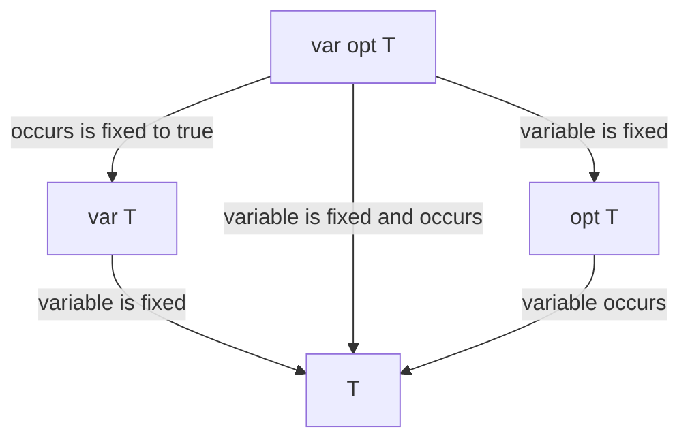

# Generation of function dispatch preambles

The [MicroZinc Interpreter](../../interpreter.md) only supports static dispatch. Therefore, to emulate dynamic dispatch
to more specific versions of functions, we can add preambles to the bodies of functions which dispatch to the other
versions.

Dispatch follows this hierarchy:

We consider a directed graph where the nodes are each function. Then, for each pair of overloads of a function, if the
parameters of one can all dispatch to other (or are the same type), then we add this as an edge.

Then by getting the transitive reduction, we can determine a list of functions each function needs to dispatch to.
