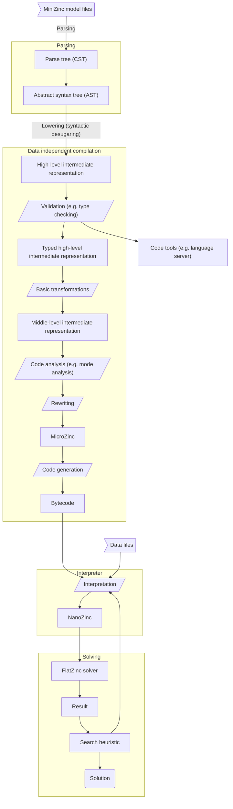

# The compilation process

The Shackle compiler takes a MiniZinc model and compiles it into a bytecode program which is interpreted to produce
FlatZinc for solvers. Compilation is divided into modules dealing with each of the major source code representations.
Frontend analysis predominantly uses the [high-level intermediate representation (HIR)](./compilation/hir/hir.md). The
[typed high-level (THIR)](./compilation/thir/thir.md) and [mid-level (MIR)](./compilation/mir/mir.md) intermediate
representations deal with transforming the MiniZinc program into MicroZinc, then finally the
[bytecode generation](./compilation/bytecode-gen.md) step takes place to produce the final compiled program. This
program is data-independent. The interpreter parses the data runs the bytecode program to generates NanoZinc and
ultimately FlatZinc for the solver.

## Compilation stages

1. [Parsing](./compilation/parsing.md)  
   `tree-sitter` is used to generate a CST from a MiniZinc model.
2. [Abstract syntax tree](./compilation/ast.md)  
   Type-safe accessors for the CST, used for include resolution.
3. [High-level intermediate representation](./compilation/hir.md)  
   A syntactic desugaring phase for the first main intermediate representation.  
   Includes scope collection, name resolution, function resolution, type
   checking, and various validation checks.
4. [Typed high-level intermediate representation](./compilation/thir.md)  
   A semantic desugaring phase which combines the HIR nodes with their computed types.  
   Includes type specialisation and removal of optional and enum types, as well as other model-level transformations.
5. [Mid-level intermediate representation](./compilation/mir.md)  
   The MiniZinc THIR is transformed into a MicroZinc AST.
6. [Bytecode generation](./compilation/bytecode-gen.md)  
   Code generation of a program which will be interpreted to generate the final FlatZinc.
7. [Bytecode interpretation](./compilation/interpreter.md)  
   The bytecode along with the data is interpreted to produce NanoZinc and later FlatZinc or any other format for
   solver backends.

## Query-based architecture

The compiler utilises [`Salsa`](https://github.com/salsa-rs/salsa) to provide a demand-driven, incremental architecture.
Salsa tracks the dependencies for queries, and memoises query results to avoid recomputation where possible. This is
especially useful for the language server. The compiler frontend up to the HIR stage is designed to be incremental
with respect to changing input files - if a model is changed, then only the changed portion, and anything that depended
on it will be recomputed.

This means we use a 'pull' architecture - tasks are done lazily when demanded. The main query produces the compiled
program, requires the MIR, which in turn requires the THIR, which in turn requires the HIR, which in turn requires
the parsed model files. The `CompilerDatabase` is the main query database for the compiler. The actual queries are
defined in the database trait for the module they belong to.

## Development

- THIR can be pretty-printed to produce a model file which can be fed to the old compiler
- MIR should be able to do the same
- This allows us to test the compiler without having to also write the interpreter

## Other compilers

Much of the design of the compiler has been influenced by other projects, particularly

- [Rust Analyzer](https://github.com/rust-analyzer/rust-analyzer)
- [The Rust compiler](https://rust-lang.org)
- [Mun](https://github.com/mun-lang/mun)
